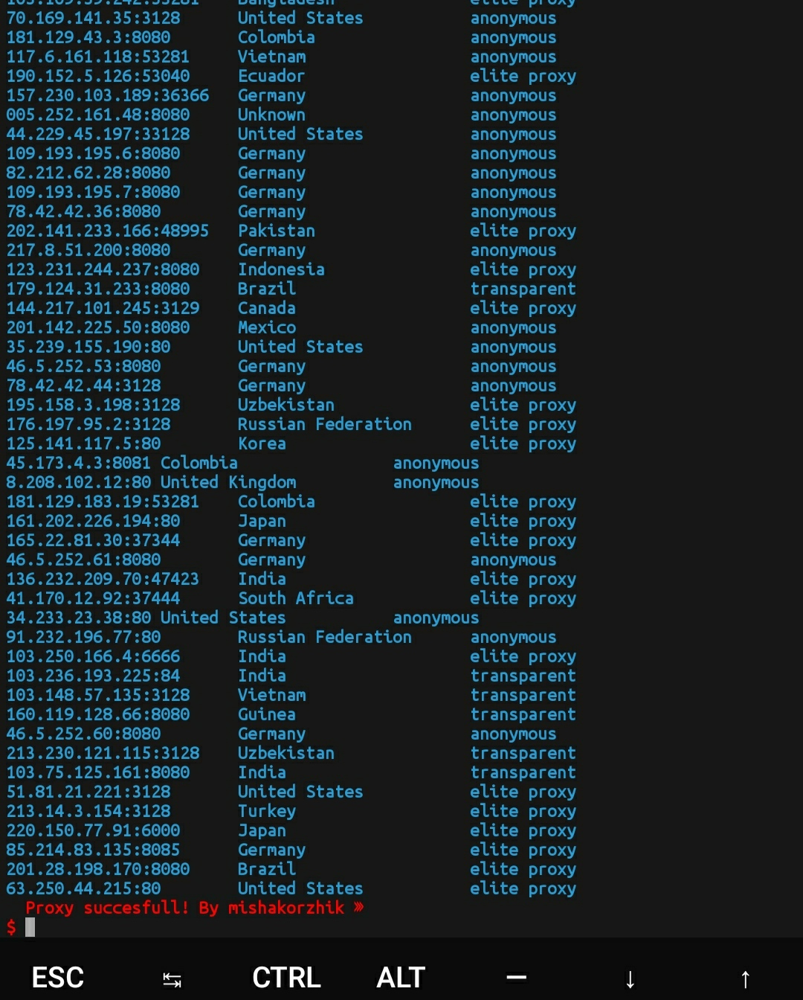
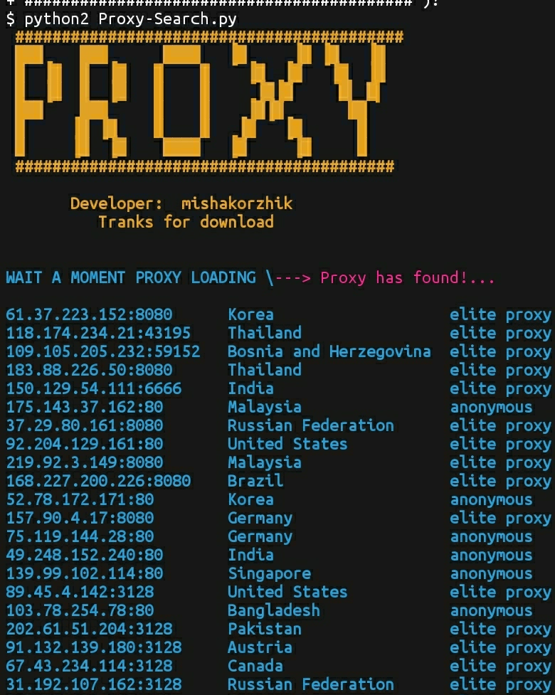

# Free-Proxy
#### Hi, you can download the proxy utility here.
  

---
## Installing for termux

* `pkg install git`
* `git clone https://github.com/mishakorzik/Free-Proxy`
* `cd Free-Proxy`
* `bash Setup.sh`

#### Everything is ready! Now we are waiting for everything to download!
 * `succes`

---
## Installing for linux

* `pkg install git`
* `git clone https://github.com/mishakorzik/Free-Proxy` 
* `cd Free-Proxy`
* `bash SetupLinux.sh`

---
## Start Proxy Termux and Linux

#### Enter a command to start the proxy.

* `bash FreeProxy.sh`

---

#### command for auto update tool.

* `bash AutoUpdate.sh

#### view utility updates and how the utility was updated.
#### <a href="src/UPGRADE.md">View utility updates</a>

#### Everything is ready!  now the program will give you all the proxy servers.
---
## Screenshot

#### here you can see a screenshot of the proxy
 

 

###### By mishakorzhik: Report bug: misakorzik528@gmail.com

